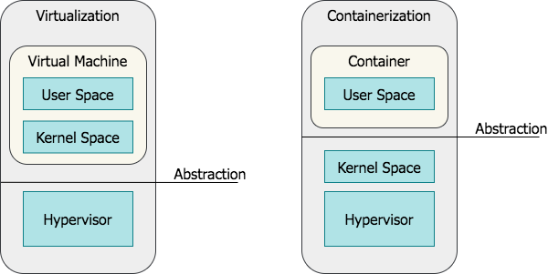
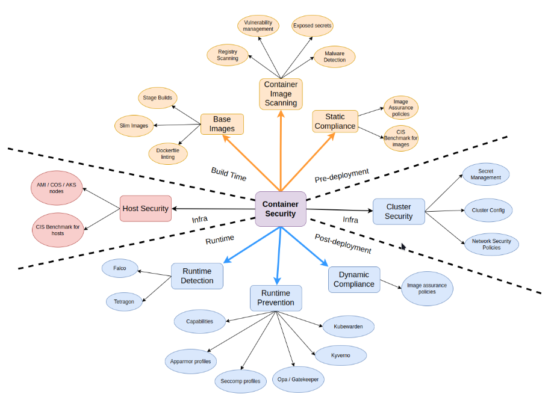
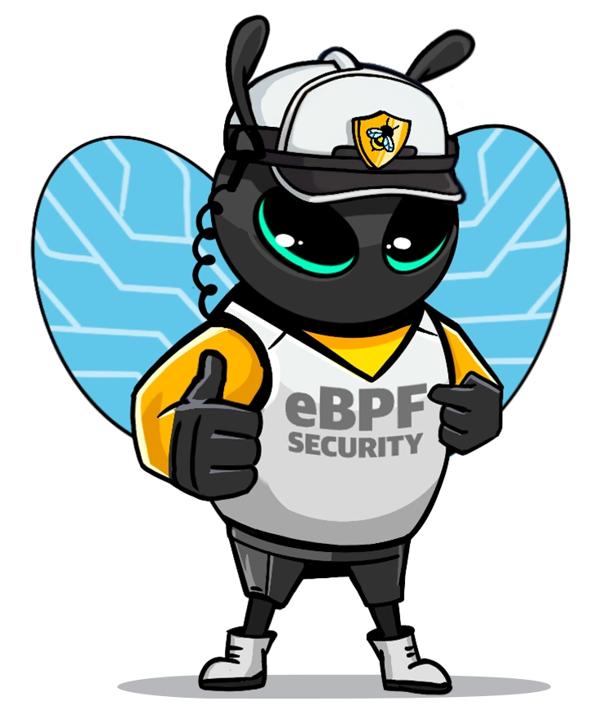
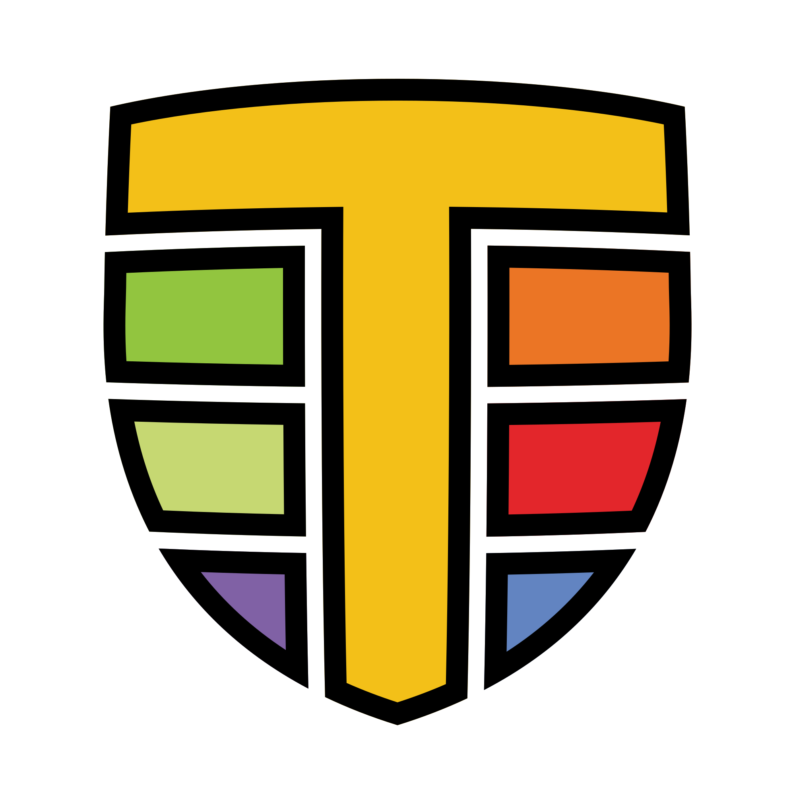
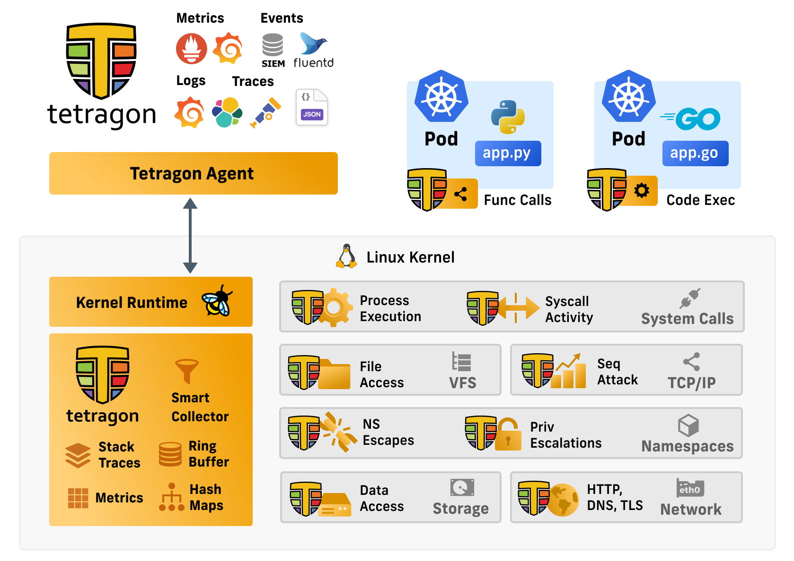
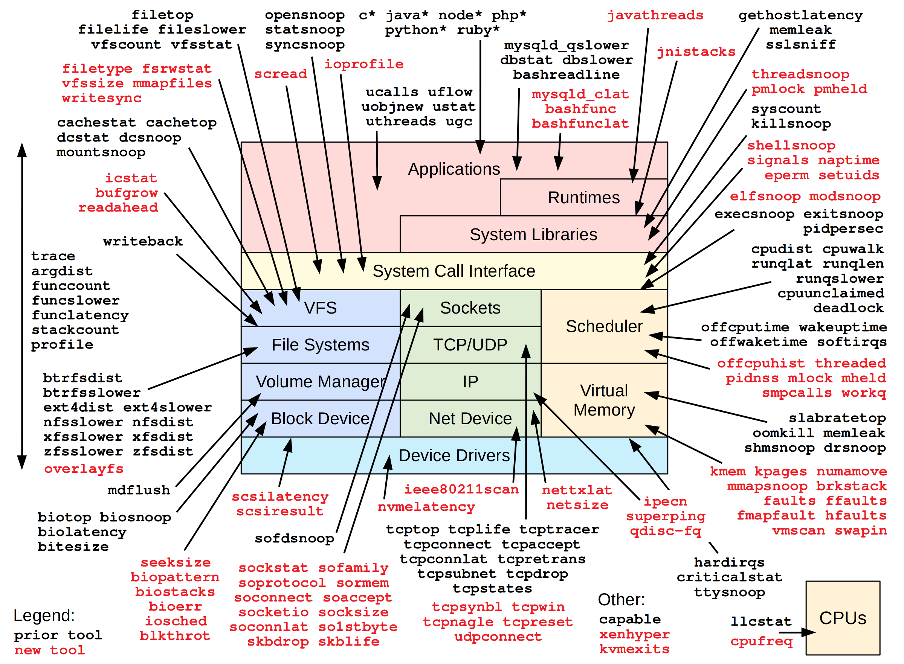

## Containers vs VMs
{fig-align="center"}

## User Space vs Kernel Space
{fig-align="center"}

## Container Security
{fig-align="center"}

## eBPF {.center}
:::: {.columns}

::: {.column width="70%"}
eBPF is a technology that can run programs in a privileged context such as the operating system kernel. It is the successor to the Berkeley Packet Filter filtering mechanism in Linux and is also used in other parts of the Linux kernel as well
:::

::: {.column width="30%"}

:::

::::

## Cilium {.center}
:::: {.columns}

::: {.column width="70%"}
Cilium is an open source, cloud native solution for providing, securing, and observing network connectivity between workloads, fueled by the revolutionary Kernel technology eBPF
:::

::: {.column width="30%"}
{fig-align="center" height=200}
:::

::::

## Tetragon {.center}
:::: {.columns}

::: {.column width="70%"}
Tetragon is a flexible Kubernetes-aware security observability and runtime enforcement tool that applies policy and filtering directly with eBPF, allowing for reduced observation overhead, tracking of any process, and real-time enforcement of policies.
:::

::: {.column width="30%"}

:::

::::

---

## Monitor Process Execution {.center}
Observe the complete lifecycle of every process on your machine with Kubernetes context awareness

---

## Runtime Security Policies {.center}
Translate high level policies for file monitoring, network observability, container security, and more into low overhead eBPF programs

---

## Real Time Enforcement {.center}
Synchronous monitoring, filtering, and enforcement completely in the kernel with eBPF

---

## How does Tetragon work {.center}
{fig-align="center"}

---

## Tetragon Detailed Architecture
{fig-align="center"}

---

## Requirements {.center}
Tetragon needs Linux kernel version 4.19 or greater.

We currently run tests on stable long-term support kernels 4.19, 5.4, 5.10, 5.15

BPF evolves rapidly and we recommend you use the most recent stable kernel possible to get the most out of Tetragon’s features.

---

## Linux kernel configuration options needed to run Tetragon {.center}

```
# CORE BPF
CONFIG_BPF
CONFIG_BPF_JIT
CONFIG_BPF_JIT_DEFAULT_ON
CONFIG_BPF_EVENTS
CONFIG_BPF_SYSCALL
CONFIG_HAVE_BPF_JIT
CONFIG_HAVE_EBPF_JIT
CONFIG_FTRACE_SYSCALLS

# BTF (BPF Type Format) is the metadata format which encodes the debug info related to BPF program/map.
CONFIG_DEBUG_INFO_BTF
CONFIG_DEBUG_INFO_BTF_MODULES

# Enforcement
CONFIG_BPF_KPROBE_OVERRIDE

# CGROUP and Process tracking
CONFIG_CGROUPS=y        Control Group support
CONFIG_MEMCG=y          Memory Control group
CONFIG_BLK_CGROUP=y     Generic block IO controller
CONFIG_CGROUP_SCHED=y
CONFIG_CGROUP_PIDS=y    Process Control group
CONFIG_CGROUP_FREEZER=y Freeze and unfreeze tasks controller
CONFIG_CPUSETS=y        Manage CPUSETs
CONFIG_PROC_PID_CPUSET=y
CONFIG_CGROUP_DEVICE=Y  Devices Control group
CONFIG_CGROUP_CPUACCT=y CPU accouting controller
CONFIG_CGROUP_PERF=y
CONFIG_CGROUP_BPF=y     Attach eBPF programs to a cgroup
CGROUP_FAVOR_DYNMODS=y  (optional)  >= 6.0
  Reduces the latencies of dynamic cgroup modifications at the
  cost of making hot path operations such as forks and exits
  more expensive.
  Platforms with frequent cgroup migrations could enable this
  option as a potential alleviation for pod and containers
  association issues.
```

---

## eBPF Hook Overview


## eBPF Tracing Hooks



# Tetragon Concepts

## Events {.center}
Tetragon’s events are exposed to the system through either the gRPC endpoint or JSON logs.

## Tracing Policy {.center}
Tetragon’s TracingPolicy is a user-configurable Kubernetes custom resource (CR) that allows users to trace arbitrary events in the kernel and optionally define actions to take on a match.

Policies consist of a hook point (kprobes, tracepoints, and uprobes are supported), and selectors for in-kernel filtering and specifying actions.

## Hook points {.center}
Tetragon can hook into the kernel using kprobes and tracepoints, as well as in user-space programs using uprobes.

These hook points include arguments and return values that can be specified using the args and returnArg fields.

## Arguments {.center}
Kprobes, uprobes and tracepoints all share a needed arguments fields called args. It is a list of arguments to include in the trace output. Tetragon’s BPF code requires information about the types of arguments to properly read, print and filter on its arguments. This information needs to be provided by the user under the args section.

## Mapping function calls in arguments
```yaml
args:
- index: 0
  type: "int"
- index: 1
  type: "file"
```
To properly read and hook onto the `fd_install(unsigned int fd, struct file *file)` function, the YAML snippet above tells the BPF code that the first argument is an int and the second argument is a file, which is the struct file of the kernel. In this way, the BPF code and its printer can properly collect and print the arguments.

## Selectors {.center}
Selectors are a way to perform in-kernel BPF filtering on the events to export, or on the events on which to apply an action.

## Namespace filtering {.center}
For namespace filtering we use TracingPolicyNamespaced which has the same contents as a TracingPolicy, but it is defined in a specific namespace and it is only applied to pods of that namespace.

## Pod label filters {.center}
For pod label filters, we use the PodSelector field of tracing policies to select the pods that the policy is applied to.

## Container field filters {.center}
For container field filters, we use the containerSelector field of tracing policies to select the containers that the policy is applied to. At the moment, the only supported field is name.


## Enforcement {.center}
Tetragon allows enforcing events in the kernel inline with the operation itself.

---

## Tracing Policy Binaries {.center}
```yaml
apiVersion: cilium.io/v1alpha1
kind: TracingPolicyNamespaced
metadata:
  name: "file-monitoring-filtered"
spec:
  kprobes:
  - call: "security_file_permission"
    syscall: false
    return: true
    args:
    - index: 0
      type: "file" # (struct file *) used for getting the path
    - index: 1
      type: "int" # 0x04 is MAY_READ, 0x02 is MAY_WRITE
    returnArg:
      index: 0
      type: "int"
    returnArgAction: "Post"
    selectors:
    - matchBinaries:
      - operator: "In"
        values:
        - "/usr/bin/cat"
        - "/usr/bin/tail"
        - "/usr/bin/bash"
      matchActions:
      - action: Sigkill

```

## Tracing Policy Network {.center}
```yaml
apiVersion: cilium.io/v1alpha1
kind: TracingPolicy
metadata:
  name: "connect"
spec:
  kprobes:
  - call: "tcp_connect"
    syscall: false
    args:
    - index: 0
      type: "sock"
    selectors:
    - matchBinaries:
      - operator: "In"
        values:
          - "/usr/bin/curl"
          - "/usr/bin/wget"
      matchActions:
      - action: Sigkill
```
# Demo time

::::{.columns}

:::{.column width="60%"}
1. Show Architecture (next slide)
2. Show Apps
3. Test Apps (curl)
4. Show process execution (hubble/prometheus/grafana)
5. Block process execution
:::

:::{.column width="40%"}
<iframe src="https://giphy.com/embed/bEVKYB487Lqxy" width="480" height="264" style="" frameBorder="0" class="giphy-embed" allowFullScreen></iframe>
:::
::::

## Demo Architecture
{fig-align="center"}


# Questions ?
<iframe src="https://giphy.com/embed/APqEbxBsVlkWSuFpth" width="432" height="480" style="display: block;margin: auto" frameBorder="0" class="giphy-embed" allowFullScreen></iframe>

# Thanks !
<iframe src="https://giphy.com/embed/lD76yTC5zxZPG" width="600" height="441" style="display: block;margin: auto" frameBorder="0" class="giphy-embed" allowFullScreen></iframe>
