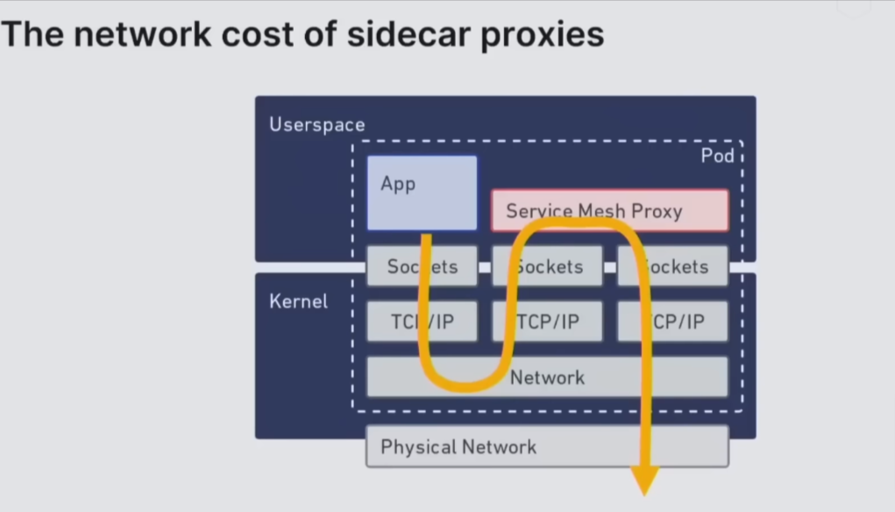
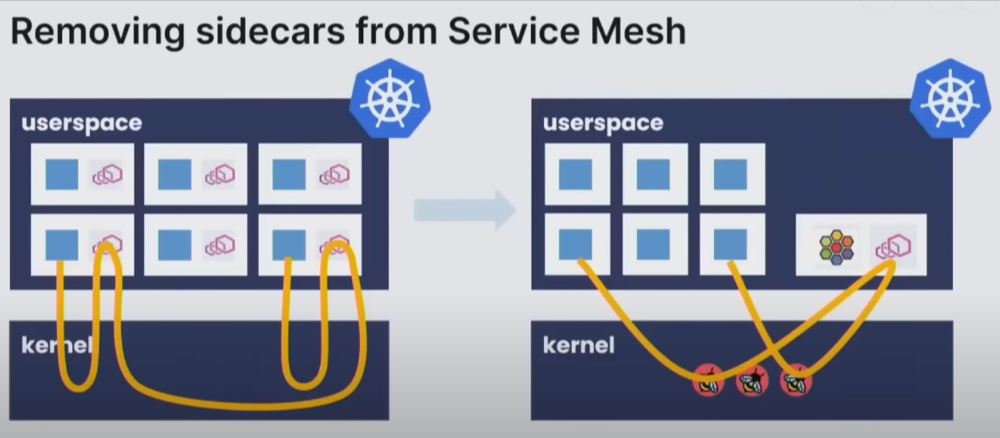
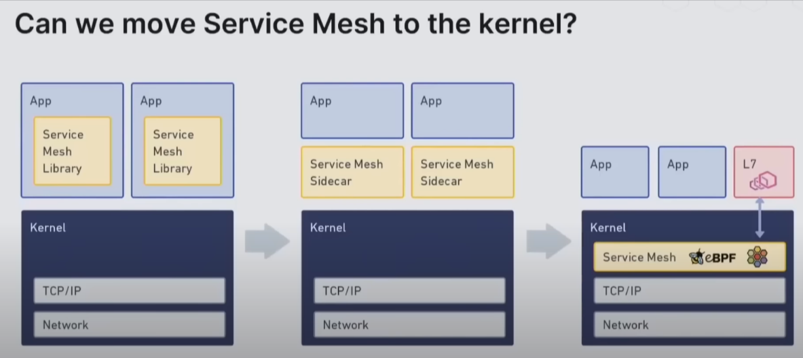
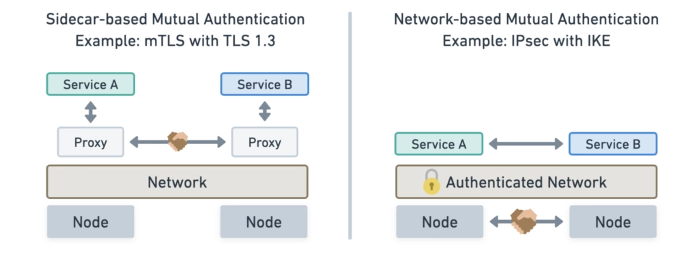

## The problem {.center}

- Kubernetes is not secure by default
- How to manage certificates and identity ?
- How to do the above without too much work in the developer side ?
- How to limit lateral movement inside kubernetes ?

---

## Network policy to manage identity ? {.center}

- Not a real identity
- In cloud native world, could have problems with dinamic ip association

---

## Introducing the sidecar Model {.center}


---

## The sidecar Model has yaml {.center}


# The sidecarless Model

---

### What is eBPF ? {.center}

extended Berkley Packet Filter


{width="500px" fig-align="center"}

---

### Look Ma's, without sidecar {.center}


---

## Sidecar vs eBPF {.center}


---

## eBPF Architecture {.center}


---

## Cilium eBPF with envoy ?


---

## eBPF Hook Overview


---

## Security with ebpf {.center}


---

## But what about Service Mesh ? {.center}

---

## Traffic Management {.center}
The network cost of sidecar proxies

{width="100%"}

---

## Without sidecars {.center}
Removing sidecars from Service Mesh

{width="100%"}

---

## Evolution ? Not exactly, yet {.center}

Can We move Service Mesh to the Kernel ? Kinda off...

{width="100%"}

---

## Tradeoffs {.center}


# What about Istio ? {.center}

---

## Security Overview {.center}


---

## Istio Security {.center}
The Istio security features provide strong identity, powerful policy, transparent TLS encryption, and authentication, authorization and audit (AAA) tools to protect your services and data.

---

## Goals of Istio security {.center}

-   Security by default: no changes needed to application code and infrastructure
-   Defense in depth: integrate with existing security systems to provide multiple layers of defense
-   Zero-trust network: build security solutions on distrusted networks

---

## Istio Architecture  {.center}


---

## Identity And Certificate Management  {.center}
{width=500}

---

## Authentication Architecture  {.center}
{width=800}

---

## PeerAuthentication  {.center}
```yaml
apiVersion: security.istio.io/v1beta1
kind: PeerAuthentication
metadata:
  name: default
  namespace: foo
spec:
  mtls:
    mode: PERMISSIVE

---

apiVersion: security.istio.io/v1beta1
kind: PeerAuthentication
metadata:
  name: default
  namespace: foo
spec:
  selector:
    matchLabels:
      app: finance
  mtls:
    mode: STRICT

```

---

## Authorization Architecture  {.center}


---

## AuthorizationPolicy  {.center}
```yaml
apiVersion: security.istio.io/v1beta1
kind: AuthorizationPolicy
metadata:
 name: httpbin
 namespace: foo
spec:
 action: ALLOW
 rules:
 - from:
   - source:
       principals: ["cluster.local/ns/default/sa/sleep"]
   - source:
       namespaces: ["test"]
   to:
   - operation:
       methods: ["GET"]
       paths: ["/info*"]
   - operation:
       methods: ["POST"]
       paths: ["/data"]
   when:
   - key: request.auth.claims[iss]
     values: ["https://accounts.google.com"]

```

---

## Routes with VirtualService  {.center}
Public routes & Private Routes

```yaml
apiVersion: networking.istio.io/v1alpha3
kind: VirtualService
metadata:
  name: reviews-route
spec:
  hosts:
  - reviews.prod.svc.cluster.local
  http:
  - name: "reviews-v2-routes"
    match:
    - uri:
        prefix: "/wpcatalog"
    - uri:
        prefix: "/consumercatalog"
    rewrite:
      uri: "/newcatalog"
    route:
    - destination:
        host: reviews.prod.svc.cluster.local
        subset: v2
  - name: "reviews-v1-route"
    route:
    - destination:
        host: reviews.prod.svc.cluster.local
        subset: v1

```

---

## Cors {.center}

```yaml
apiVersion: networking.istio.io/v1alpha3
kind: VirtualService
metadata:
  name: ratings-route
spec:
  hosts:
  - ratings.prod.svc.cluster.local
  http:
  - route:
    - destination:
        host: ratings.prod.svc.cluster.local
        subset: v1
    corsPolicy:
      allowOrigins:
      - exact: https://example.com
      allowMethods:
      - POST
      - GET
      allowCredentials: false
      allowHeaders:
      - X-Foo-Bar
      maxAge: "24h"

```

---

## Extending functionality with WASM {.center}
WasmPlugins provides a mechanism to extend the functionality provided by the Istio proxy through WebAssembly filters.

```yaml
apiVersion: extensions.istio.io/v1alpha1
kind: WasmPlugin
metadata:
  name: openid-connect
  namespace: istio-ingress
spec:
  selector:
    matchLabels:
      istio: ingressgateway
  url: file:///opt/filters/openid.wasm
  sha256: 1ef0c9a92b0420cf25f7fe5d481b231464bc88f486ca3b9c83ed5cc21d2f6210
  phase: AUTHN
  pluginConfig:
    openid_server: authn
    openid_realm: ingress
```

---

{width=200}

SPIFFE, the Secure Production Identity Framework For Everyone, provides a secure identity, in the form of a specially crafted X.509 certificate, to every workload in a modern production environment.

SPIFFE removes the need for application-level authentication and complex network-level ACL configuration.

---

## What is SPIRE?  {.center}
**SPIRE**, the SPIFFE Runtime Environment, is an extensible system that implements the principles embodied in the SPIFFE standards. SPIRE manages platform and workload attestation, provides an API for controlling attestation policies, and coordinates certificate issuance and rotation.

---

## All powered by MTLS  {.center}


---

## Session VS Network based authentication  {.center}



---

## With Sidecar VS Sidecarless  {.center}


---

## Envoy with curiefense  {.center}

Curiefense is an API-first, DevOps oriented web-defense HTTP-Filter adapter for Envoy and NGINX. It provides multiple security technologies **(WAF, application-layer DDoS protection, bot management, and more)** along with real-time traffic monitoring and transparency.

---

## Curiefense architecture  {.center}


---

## Demo Time {.center}
- Show diagrams (next slide)
- Show code
- Show console commands
- Show kiali, grafana and jaeger
- Show istio documentation

---

## Kubernetes Part {.center}


---

## Network Part {.center}


---

## References  {.center}
- https://istio.io/latest/docs/concepts/security

# Questions ?  {.center}